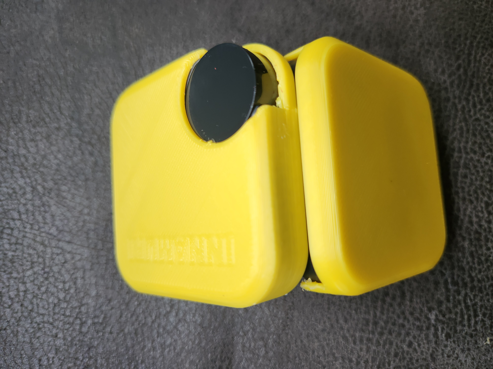
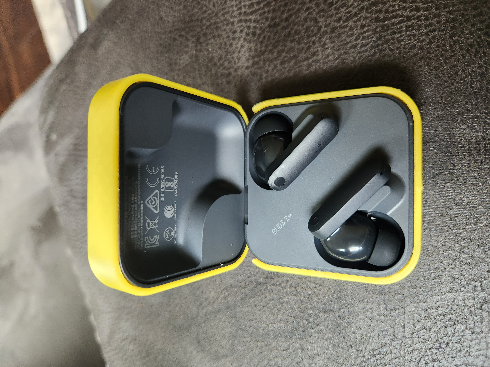
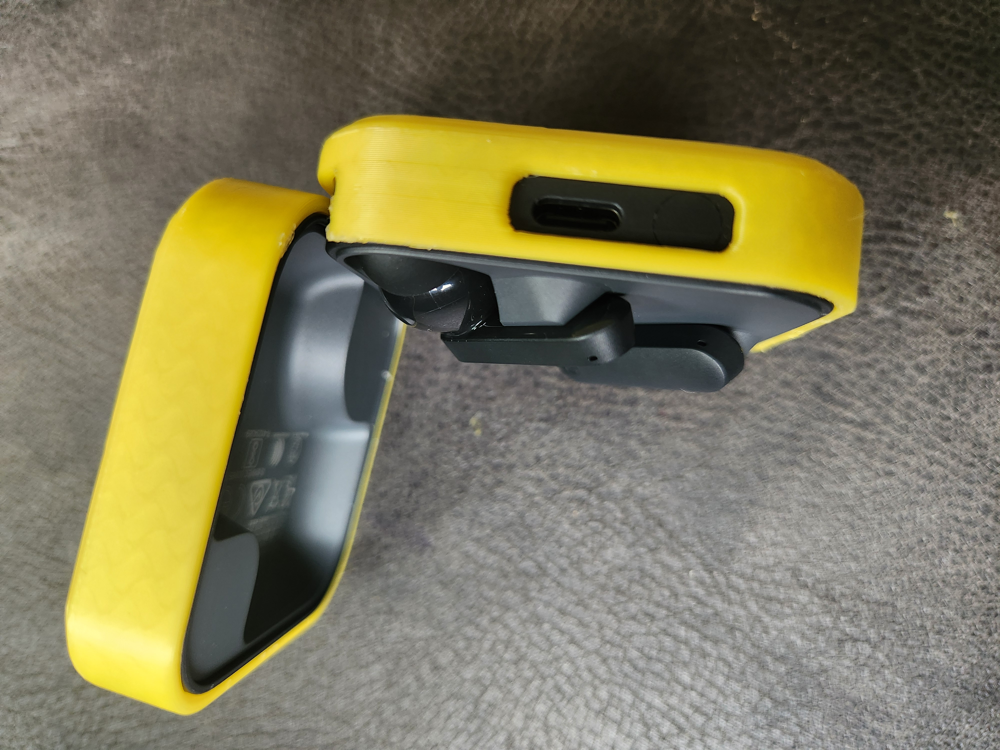
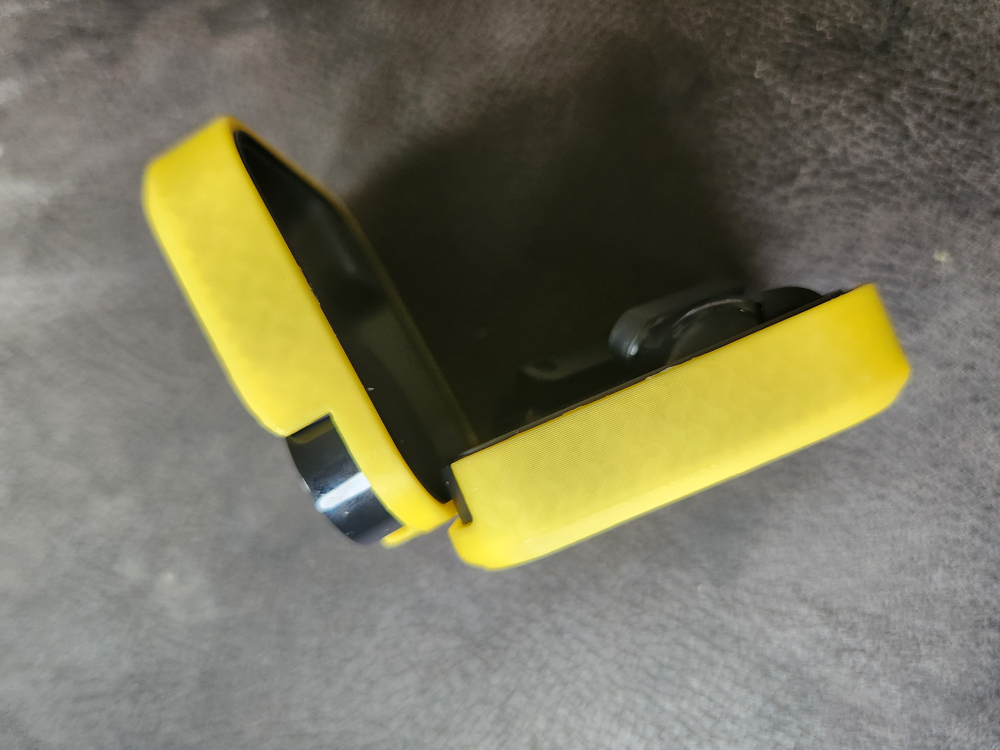

## Description
This folder contains relevant files to enable 3d printing a case for my earbuds. The resulted case is a very good fit, but I use shoe goo for even better adhesion and peels off easy. I would recommend it

## Details
Make: CMF by Nothing
Model: buds 2a
CAD Software: Autocad Fusion
Slicer: Ultimaker Cura

## Images
|  |  |  |  |
| - | - | - | - |
|  |  |  |  |