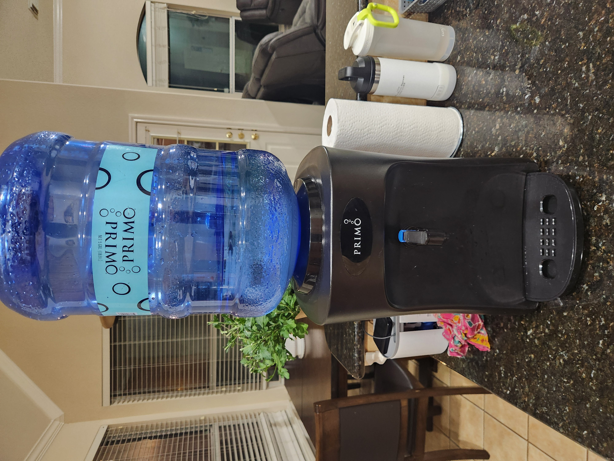

## Description
I have a primo table top water dispenser. The hadle broke after 2 years of use. I tried finding a replacement on amazon and could not find any viable options. The result was good and my family felt its better than origional as this one has longer handle (therefore more torque) which make the push much lighter

## Details
Make: Primo
Model: 601346
Item purchased in: [Walmart](walmart.com/ip/Primo-Water-Countertop-Dispenser-Top-Loading-Room-Temperature-Black-3-or-5-Gallon/160719899?wmlspartner=wlpa&selectedSellerId=0&wl13=1129&gclsrc=aw.ds&adid=22222222277160719899_117755028669_12420145346&wl0=&wl1=g&wl2=c&wl3=501107745824&wl4=pla-394283752452&wl5=9028284&wl6=&wl7=&wl8=&wl9=pla&wl10=8175035&wl11=local&wl12=160719899&veh=sem_LIA&gclsrc=aw.ds&gad_source=1&gad_campaignid=12420145346&gbraid=0AAAAADmfBIpneLDDDf2Z4o9PuICXwjOk3&gclid=CjwKCAjw2vTFBhAuEiwAFaScwtDhqu7p4B-8SB0pvi27Quf8SW93HacHX-VAwwhpa18xjtErlRVovxoC-SMQAvD_BwE)
CAD Software: Autocad Fusion
Slicer: Ultimaker Cura

## Images
|  |  |  |  |
| - | - | - | - |
|  |  |  |  |
